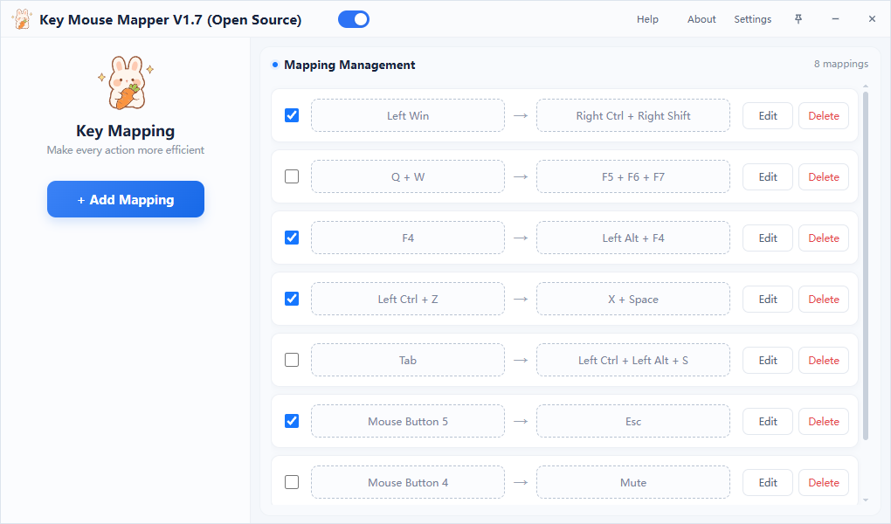
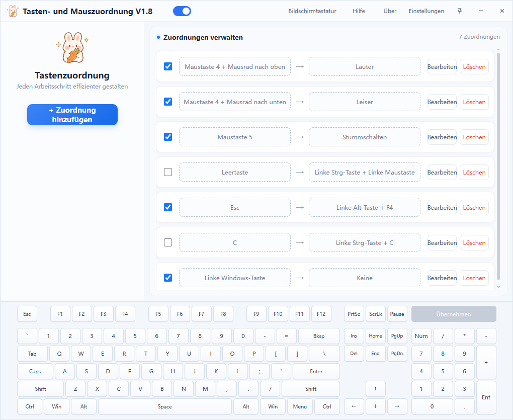

<h1 align="center">Key Mouse Mapper v1.7</h1>

<p align="center">A lightweight, straightforward, real-time keyboard and mouse remapper for Windows</p>

<p align="center">
  <a href="./README.md">简体中文</a> ·
  <a href="./README.en.md">English</a>
</p>

<p align="center">
  <a href="https://github.com/fuyingde/key-mouse-mapper/releases/latest"></a>
  
  <a href="./LICENSE"></a>
</p>

Remap keyboard keys and mouse buttons without changing the system's keyboard-layout registry or restarting Windows. Record a source and a target, save the mapping, and enable it. Exit the app to stop every mapping and restore the original input.

<p align="center">
  <strong><a href="https://github.com/fuyingde/key-mouse-mapper/releases/latest">Download the latest release</a></strong>
  · <a href="#get-started-in-three-steps">Quick start</a>
  · <a href="https://github.com/fuyingde/key-mouse-mapper/issues">Report an issue</a>
</p>

> Download the release EXE and run it directly without setting up a development environment

This tool focuses on lightweight, straightforward keyboard and mouse remapping. It does not provide scripting macros, game-controller mapping, per-application profiles, or complex automation. Configure a mapping once and use it globally. The app does not connect to the network on its own, is free to use, contains no advertising or promotional pop-ups, and stays quietly out of the way while it works.

## Why choose Key Mouse Mapper

Some remapping solutions require users to edit the registry, enter key codes manually, install a large utility suite, or restart Windows. Key Mouse Mapper is intended for users who want to complete essential keyboard and mouse remapping quickly:

- Record keys visually without memorizing key names or writing configuration files
- Apply mappings immediately and restore original input when the app exits, without permanently changing system keys
- Use keyboard keys, mouse buttons, wheel directions, and combinations containing up to three keys
- Enable mappings individually or temporarily pause every mapping from the title bar
- Keep configuration on the local computer without collecting or uploading user data
- Inspect and build the published source code
- Choose from seven built-in interface languages

Key Mouse Mapper performs remapping while it is running instead of permanently changing system keys through the registry. Mappings therefore stop and original input is restored when the app exits completely. To reduce daily setup, the app provides Start with Windows and a tray-icon visibility option, allowing it to start with Windows and run quietly in the background when desired.

## Interface preview



<details>
<summary>View the other six interface languages</summary>

<br>

<table>
  <tr>
    <td align="center"><br><sub>简体中文</sub></td>
    <td align="center"><br><sub>繁體中文</sub></td>
  </tr>
  <tr>
    <td align="center"><br><sub>한국어</sub></td>
    <td align="center"><br><sub>Deutsch</sub></td>
  </tr>
  <tr>
    <td align="center"><br><sub>Français</sub></td>
    <td align="center"><br><sub>Русский</sub></td>
  </tr>
</table>

</details>

## What it can do

| Capability | Description |
| --- | --- |
| Keyboard and mouse mapping | Map a key to another key, including the middle button, side buttons, and wheel directions |
| Up to three-key combinations | Both source and target combinations can contain one to three keys |
| Temporary key blocking | Set the target to “None” to suppress an input while the app is running |
| Per-mapping control | Enable mappings individually and restore original input immediately by clearing a checkbox |
| Master pause switch | Release all held outputs and pause every mapping from the title bar |
| Desktop integration | Start with Windows, tray background operation, single-instance activation, and always-on-top support |
| Seven interface languages | 简体中文, 繁體中文, English, 한국어, Deutsch, Français, and Русский |

Typical uses include replacing a broken or awkward key, customizing mouse side buttons, preventing accidental input, and moving frequently used combinations to more convenient keys.

## Get started in three steps

1. Open [Releases](https://github.com/fuyingde/key-mouse-mapper/releases/latest) and download `KeyMouseMapper-OpenSource-v1.7.exe` from Assets
2. Run the app, choose an interface language on first launch, and select “Add Mapping”
3. Record the source and target, save the mapping, and select its checkbox to enable it

Clear a mapping's checkbox whenever you want to restore the original input without deleting the rule.

## Combination and mouse rules

- Source and target combinations can contain one to three keys
- Multiple mappings may use the same target key or combination
- Duplicate source combinations and prefix conflicts are rejected; for example, `Ctrl` and `Ctrl+C` cannot both be source mappings
- The left and right mouse buttons cannot be mapped alone or used as the first source key
- After another key is pressed, either mouse button can be the second or third source key
- A wheel direction can only be the last source key

## Download and requirements

- 64-bit Windows 10 or Windows 11
- Microsoft Edge WebView2 Runtime, already present on most modern Windows systems
- The release EXE does not require a development environment or administrator privileges

To remap input inside an application running as administrator, run this tool as administrator as well. Some software using exclusive input or anti-cheat systems may not accept simulated input; follow the rules of the software and services you use.

## Privacy and safety

- The app does not collect or upload your mappings
- It does not connect to the network on its own; the default browser opens only when you select the author or repository link
- Mapping behavior does not modify the registry; a current-user startup entry is written only if you explicitly enable Start with Windows
- Exiting the app stops all mappings and does not make permanent keyboard changes

This app uses global input hooks and simulated input, so a small number of security products may report a false positive. Download builds from this repository's Releases and compare the published SHA-256, or inspect the source and build it yourself.

## What's new in v1.7

- Source and target combinations of up to three keys
- Bidirectional source-prefix conflict detection
- Multiple mappings can use the same key or combination as their target
- Added Traditional Chinese, Korean, German, French, and Russian
- Improved the mapping list, settings, About dialog, and Help

See [CHANGELOG.en.md](./CHANGELOG.en.md) for the complete history.

## Run and build from source

Running or building from source requires the appropriate Windows script runtime and compiler for the source files in this project.

```powershell
git clone https://github.com/fuyingde/key-mouse-mapper.git
cd key-mouse-mapper
powershell -NoProfile -ExecutionPolicy Bypass -File .\build.ps1
```

The build script validates configuration compatibility, open-source feature boundaries, every locale, Help, and the changelog before writing the EXE to `exe`.

### The `img` directory and icon files

`img` is reserved for application icons used during compilation; documentation screenshots belong in `docs/images`. To keep the author's original artwork private, this repository includes only `ConvertToIco.ps1` and does not include `img.ico` or `img.svg`. Before running or building from source, you must provide both files below:

| Exact path | Purpose |
| --- | --- |
| `img/img.ico` | EXE, Windows taskbar, Alt+Tab, and tray icon |
| `img/img.svg` | Title-bar and large interface icon, embedded into the EXE |

Both files must exist at these exact paths and use these exact names, or `build.ps1` will stop. `ConvertToIco.ps1` only converts a PNG into a multi-size `img.ico` containing 16 through 256-pixel frames; it does not create `img.svg`.

Use an external PNG path to keep `img` clean:

```powershell
powershell -NoProfile -ExecutionPolicy Bypass -File .\img\ConvertToIco.ps1 `
  -InputPath "C:\path\to\icon.png" `
  -OutputPath .\img\img.ico
```

Alternatively, temporarily place a transparent PNG at `img/img.png` and run the script without arguments. It writes `img.ico` beside the PNG. Delete the temporary `img.png` afterward and provide the matching `img.svg` separately.

<details>
<summary>Project structure</summary>

```text
KeyMouseMapper.ahk        Application entry point, window, and tray
Core/                    Input, mapping, settings, and localization core
index.html               Interface structure and styling
bridge.js                Interface behavior and native-side communication
locales/                 Language packs, Help, About, and changelog content
img/                     Local icon assets and the PNG-to-ICO helper
docs/images/             Interface screenshots used by the README
Lib/WebViewToo.ahk       WebView2 wrapper
tests/                   Configuration compatibility and feature-boundary tests
build.ps1                Validation and build script
```

</details>

## Questions and feedback

Use [Issues](https://github.com/fuyingde/key-mouse-mapper/issues) to report a problem, ask for help, or suggest a feature. Please include your Windows version, app version, reproduction steps, and expected result whenever possible.

## License

This project is released under the [GNU General Public License v2.0 only](./LICENSE). See [THIRD_PARTY_NOTICES.md](./THIRD_PARTY_NOTICES.md) for third-party components and licenses.

Project website: [https://www.imtr.cn/keymousetools](https://www.imtr.cn/keymousetools)
