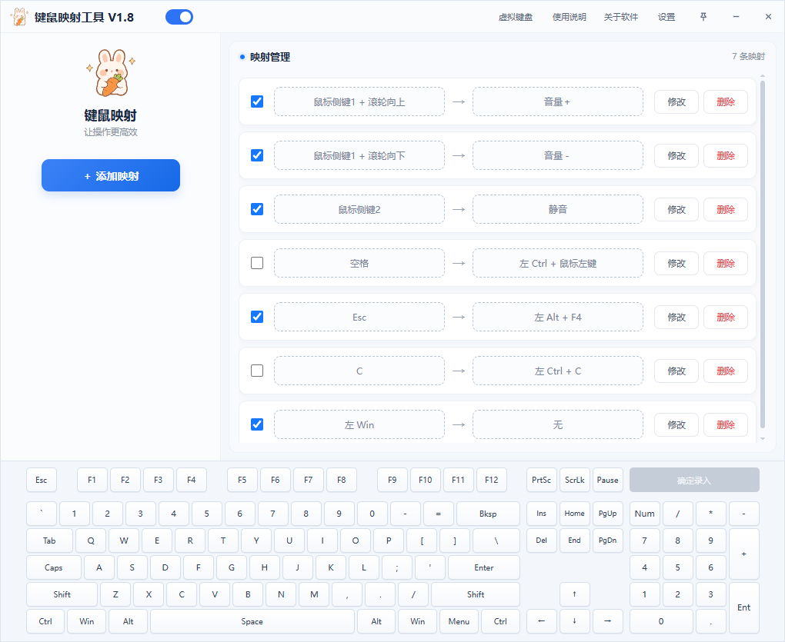

<h1 align="center">键鼠映射工具 v1.8</h1>

<p align="center">一款轻量、直观、实时生效的 Windows 键盘与鼠标按键映射工具</p>

<p align="center"><strong>Keyboard &amp; Mouse Remapper for Windows</strong></p>

<p align="center">
  <a href="./README.md">简体中文</a> ·
  <a href="./README.en.md">English</a>
</p>

<p align="center">
  <a href="https://github.com/fuyingde/windows-keyboard-mouse-remapper/releases/latest"></a>
  
  <a href="./LICENSE"></a>
</p>

无需修改系统按键注册表，也不必重启电脑。录制原始按键和目标按键、保存并勾选，映射立即生效；退出软件后，映射立即失效并恢复原始输入。

<p align="center">
  <strong><a href="https://github.com/fuyingde/windows-keyboard-mouse-remapper/releases/latest">前往 Releases 下载最新版</a></strong>
  · <a href="#三步开始使用">快速上手</a>
  · <a href="https://github.com/fuyingde/windows-keyboard-mouse-remapper/issues">反馈问题</a>
</p>

> 下载 Release 中的 EXE 即可直接使用，无需配置开发环境

本工具专注于轻量、直观的键盘与鼠标按键映射，不提供脚本宏、游戏手柄映射、按应用切换配置或复杂自动化功能。映射一次设置即可全局生效；软件不主动联网、免费使用、没有广告和推广弹窗，只在需要时安静地完成映射，不打扰你的正常工作。

## 为什么选择键鼠映射工具

有些映射解决方案需要手动编辑注册表、填写按键代码、安装大型工具或重启电脑。键鼠映射工具更适合希望快速完成基础键鼠映射的用户：

- 图形化录制按键，不需要记忆按键名称或编写配置
- 映射立即生效，退出软件后立即恢复，不会永久修改系统按键
- 同时支持键盘、鼠标按键、滚轮和最多三键组合
- 每条映射可以独立启停，也可以通过标题栏开关临时暂停全部映射
- 配置保存在本机，不收集或上传用户数据
- 源码公开，可以自行检查和编译
- 内置七种界面语言

需要注意的是，本工具采用运行时映射，而不是通过修改注册表永久改变系统按键，因此映射仅在软件运行期间有效，完全退出后会立即恢复原始输入。为了减少日常操作，软件提供开机自启和托盘图标显示开关；你可以按需让它随 Windows 启动并在后台安静运行。

## 界面预览



<details>
<summary>查看其他六种语言界面</summary>

<br>

<table>
  <tr>
    <td align="center"><br><sub>繁體中文</sub></td>
    <td align="center"><br><sub>English</sub></td>
  </tr>
  <tr>
    <td align="center"><br><sub>한국어</sub></td>
    <td align="center"><br><sub>Deutsch</sub></td>
  </tr>
  <tr>
    <td align="center"><br><sub>Français</sub></td>
    <td align="center"><br><sub>Русский</sub></td>
  </tr>
</table>

</details>

## 它能做什么

| 能力 | 说明 |
| --- | --- |
| 键盘与鼠标映射 | 将一个按键映射为另一个按键，也支持鼠标中键、侧键和滚轮方向 |
| 最多三键组合 | 原始输入和映射目标均可由 1～3 个按键组成 |
| 临时屏蔽按键 | 将目标设为“无”，即可在软件运行期间屏蔽指定输入 |
| 独立启停 | 每条映射均可单独勾选，取消勾选后立即恢复原始功能 |
| 一键暂停 | 标题栏总开关可立即释放并暂停全部映射 |
| 桌面辅助 | 支持开机自启、托盘后台运行、单实例唤醒和窗口置顶 |
| 多语言界面 | 内置简体中文、繁体中文、English、한국어、Deutsch、Français、Русский |

它适合临时替代损坏或不顺手的按键、调整鼠标侧键、屏蔽容易误触的按键，以及把常用组合改成更顺手的操作。

## 三步开始使用

1. 打开 [Releases](https://github.com/fuyingde/windows-keyboard-mouse-remapper/releases/latest)，在 Assets 中下载 `KeyMouseMapper-OpenSource-v1.8.exe`
2. 运行软件，首次启动时选择界面语言，然后点击“添加映射”
3. 依次录制原始按键和目标按键，保存并勾选该条映射

不再需要某条规则时，取消勾选即可恢复原始输入，无需删除配置。

## 组合键与鼠标规则

- 原始组合和目标组合均支持 1～3 个按键
- 多条映射可以使用相同的目标按键或目标组合
- 软件会阻止重复的原始组合及前缀冲突，例如 `Ctrl` 与 `Ctrl+C` 不能同时作为原始输入
- 鼠标左键和右键不能单独映射，也不能作为原始组合的第一个按键
- 先按下其他按键后，鼠标左键或右键可以作为原始组合的第二或第三个按键
- 滚轮方向只能放在原始组合的最后一位

## 下载与运行环境

- Windows 10 或 Windows 11，64 位
- Microsoft Edge WebView2 Runtime，多数现代 Windows 已经自带
- 运行 Release 中的 EXE 无需安装开发环境，也不需要管理员权限

如果需要映射以管理员身份运行的软件，请同时以管理员身份运行本工具。某些使用独占输入或反作弊系统的软件可能不会响应模拟输入，请遵守相关软件和服务的使用规则。

## 隐私与安全

- 软件不会收集或上传映射配置
- 软件运行时不会主动联网，只有点击作者网站或仓库地址时才会调用默认浏览器
- 按键映射本身不会修改注册表；只有用户主动启用开机自启时，才会写入当前用户的启动项
- 退出软件后，全部映射立即停止，不会永久改变系统按键

本软件使用全局输入钩子和模拟输入，因此少数安全软件可能产生误报。请从本仓库的 Releases 下载，并对照 Release 中公布的 SHA-256；如有疑虑，也可以检查源码后自行编译。

## v1.8 更新亮点

- 修复映射按下只触发一次、不会连续输入的问题
- 新增虚拟键盘，损坏或无法按下的按键可通过屏幕键盘录入映射

完整记录见 [CHANGELOG.md](./CHANGELOG.md)

## 从源码运行与编译

从源码运行或编译时，需要自行准备与项目源码对应的 Windows 脚本运行和编译环境。

```powershell
git clone https://github.com/fuyingde/windows-keyboard-mouse-remapper.git
cd windows-keyboard-mouse-remapper
powershell -NoProfile -ExecutionPolicy Bypass -File .\build.ps1
```

构建脚本会先检查配置兼容性、开源版功能边界、全部语言字段、使用说明和更新日志，再将 EXE 输出到 `exe` 目录。

### `img` 目录与图标文件

`img` 是专门存放应用程序编译图标的目录，不用于保存文档截图。为了不公开作者的原始图标资源，本仓库只提供 `ConvertToIco.ps1`，不提供 `img.ico` 和 `img.svg`。从源码运行或编译前，必须自行准备以下两个文件：

| 固定文件名 | 用途 |
| --- | --- |
| `img/img.ico` | EXE 文件、Windows 任务栏、Alt+Tab 和托盘图标 |
| `img/img.svg` | 软件界面标题栏图标和左侧大图标，会被嵌入 EXE |

两个文件都必须存在，并且目录和文件名必须与上表完全一致，否则 `build.ps1` 会停止编译。`ConvertToIco.ps1` 只负责把 PNG 转换成包含 16～256 像素多种尺寸的 `img.ico`，不会生成 `img.svg`。

推荐直接指定外部 PNG，避免把临时图片留在 `img` 目录：

```powershell
powershell -NoProfile -ExecutionPolicy Bypass -File .\img\ConvertToIco.ps1 `
  -InputPath "C:\path\to\icon.png" `
  -OutputPath .\img\img.ico
```

也可以把透明背景 PNG 临时命名为 `img/img.png`，直接运行脚本；脚本会在同一目录输出 `img.ico`。转换完成后可删除临时的 `img.png`，再自行放入配套的 `img.svg`。

<details>
<summary>查看项目结构</summary>

```text
KeyMouseMapper.ahk        程序入口、窗口与托盘管理
Core/                    输入、映射、设置和多语言核心
index.html               界面结构与样式
bridge.js                界面交互及原生端通信
locales/                 语言包、软件说明和更新日志
img/                     本地图标文件和 PNG 转 ICO 工具
docs/images/             README 使用的界面截图
Lib/WebViewToo.ahk       WebView2 封装库
tests/                   配置兼容性与功能边界测试
build.ps1                校验和构建脚本
```

</details>

## 问题与建议

欢迎通过 [Issues](https://github.com/fuyingde/windows-keyboard-mouse-remapper/issues) 报告问题、咨询使用方法或提出功能建议。提交问题时请尽量注明 Windows 版本、软件版本、操作步骤和预期结果。

## 开源许可

本项目采用 [GNU General Public License v2.0 only](./LICENSE) 发布，第三方组件及其许可证见 [THIRD_PARTY_NOTICES.md](./THIRD_PARTY_NOTICES.md)。

项目主页：[https://www.imtr.cn/keymousetools](https://www.imtr.cn/keymousetools)
